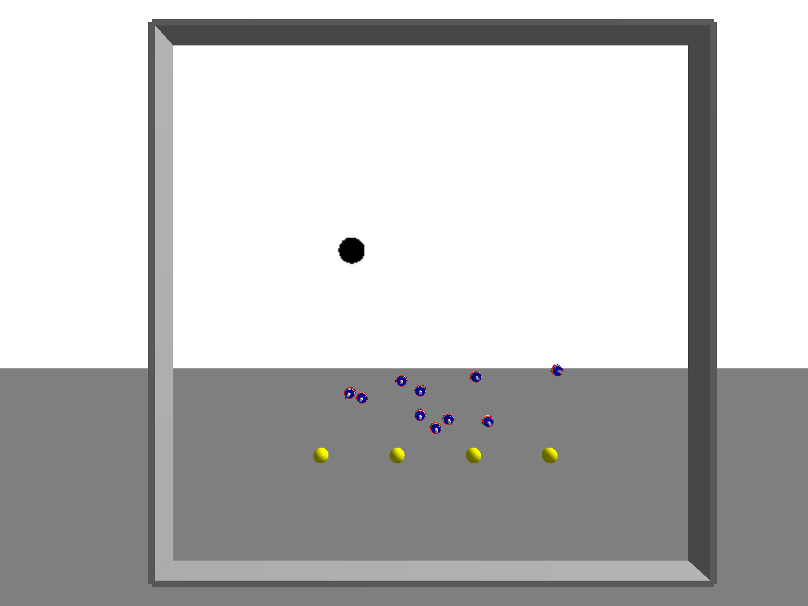
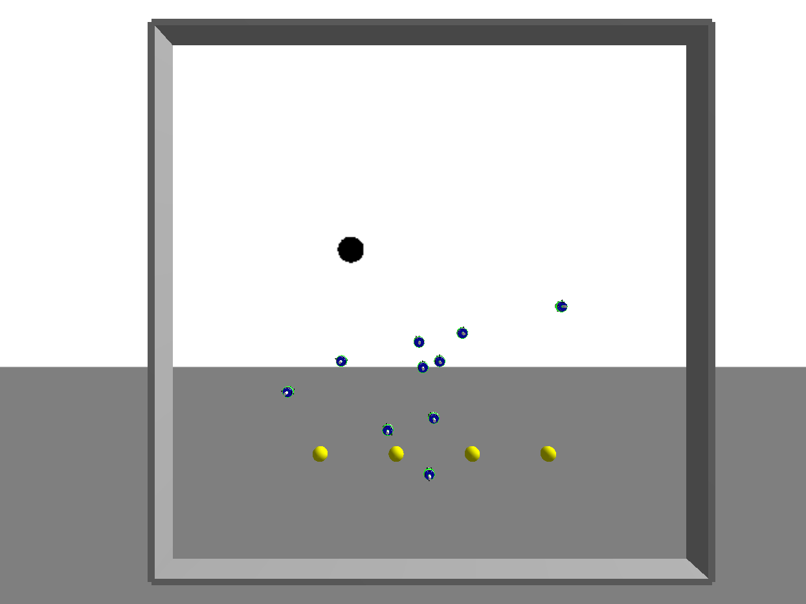
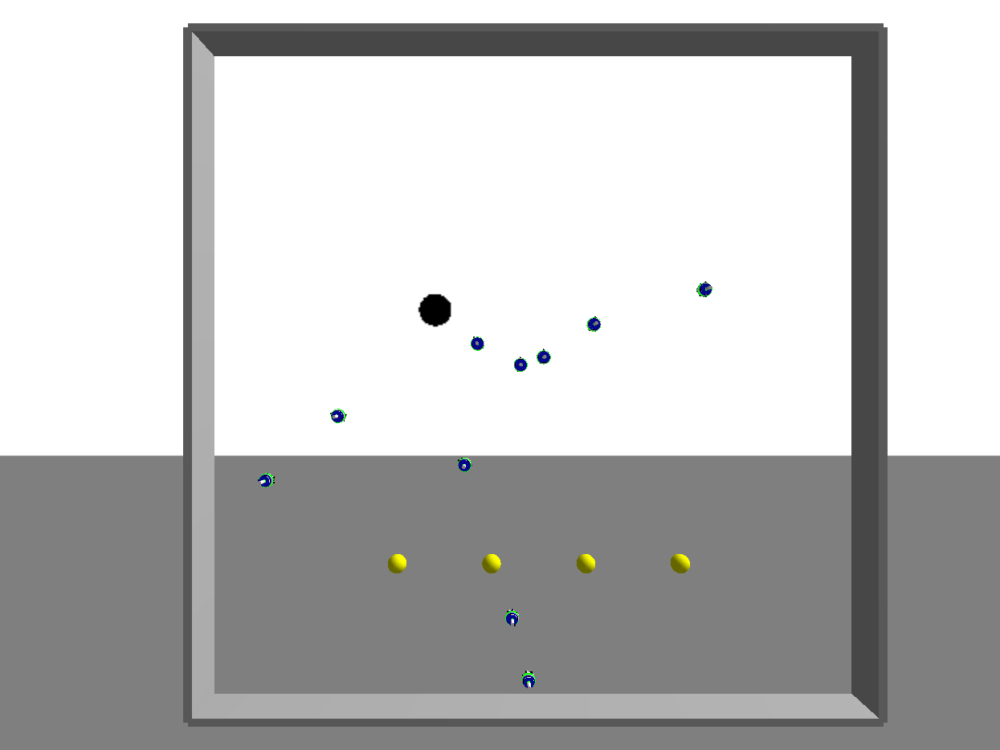
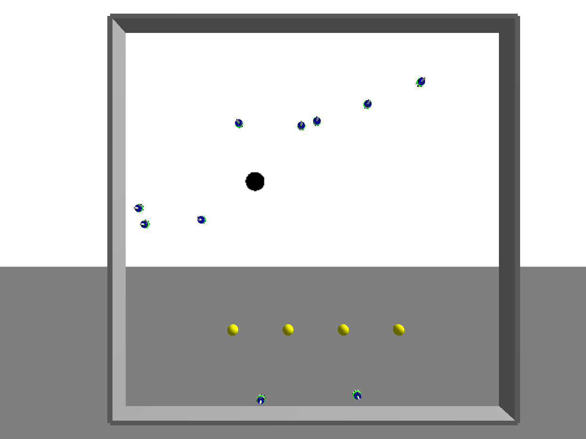
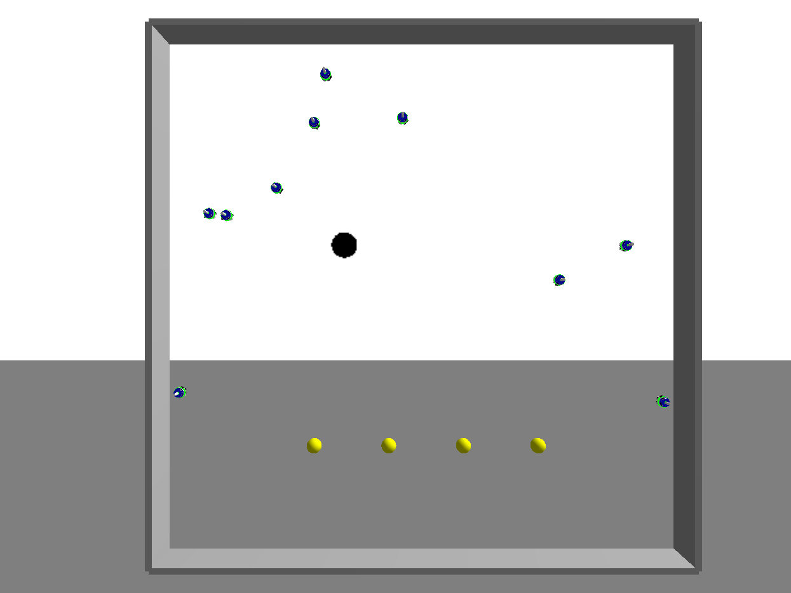
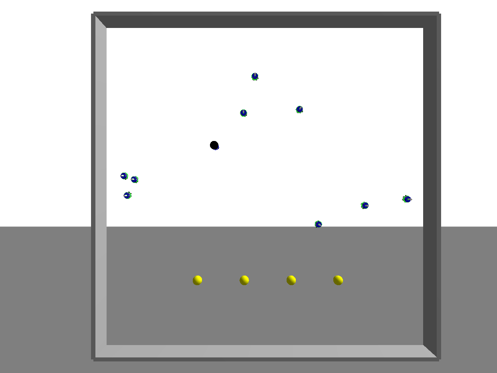

# Swarm tracking with ARGos3

## 1)Instalação (Ubuntu 18.04 e 16.04)
  * `sudo dpkg -i argos3_simulator-3.0.0-x86_64-beta56.deb`

## 2)Compilação:
  * `chmod +x compile.sh`
  * `./compile.sh`

## 3)Executando:
  * `argos3 -c swarm_tracking.argos`

# Exemplos

